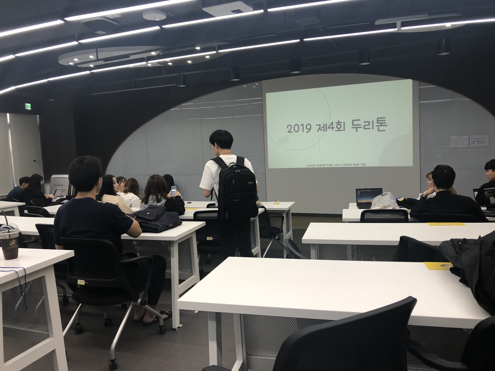
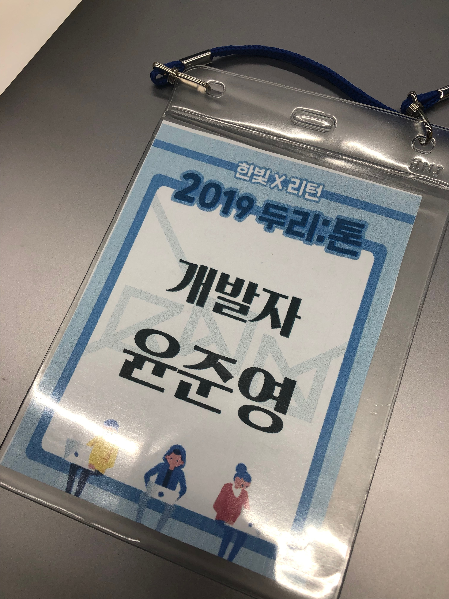
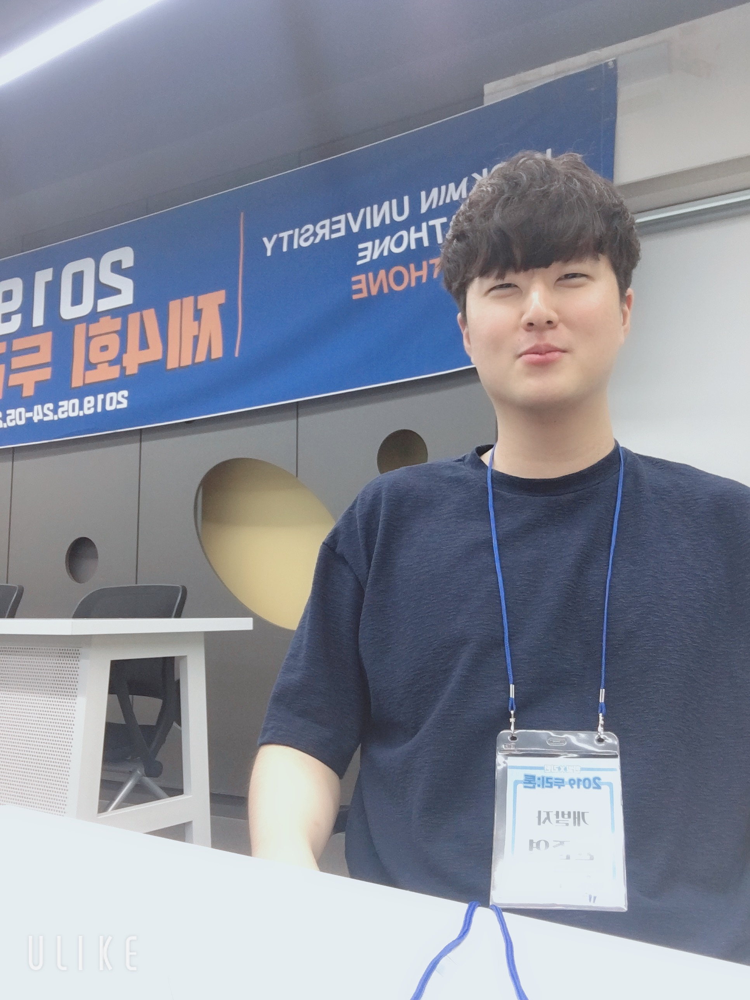
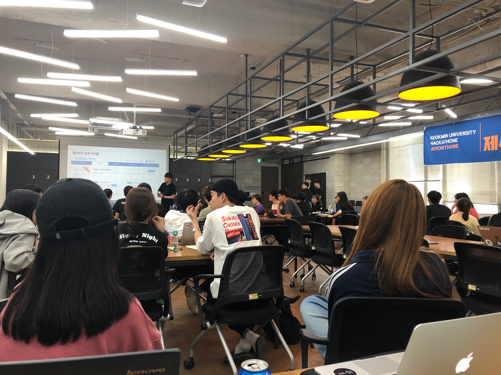
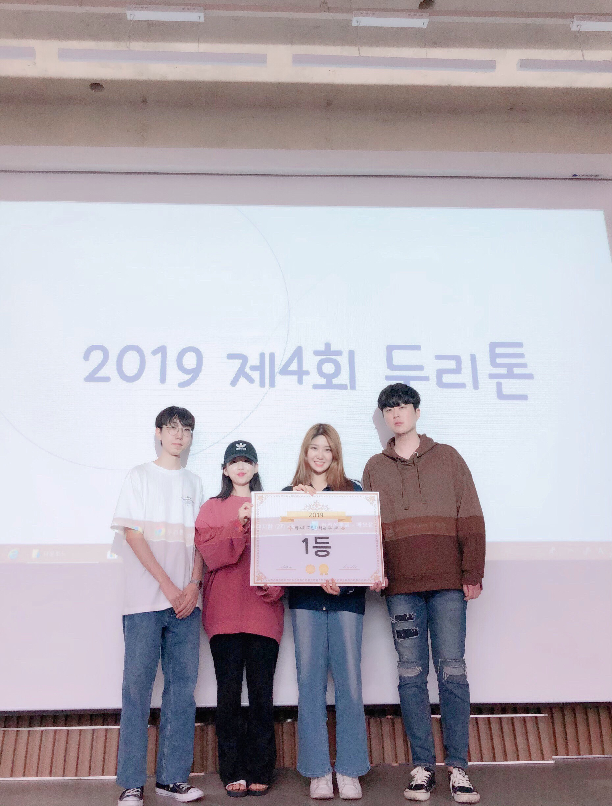

2019 국민대학교 두리톤 

저는 2019년 5월 24일에 열린 국민대학교 두리톤에 참여하였습니다. 
두리톤은 학생회 두리와 해커톤을 합친 합성어입니다. 
이번에 열린 4회 두리톤은 7호관 445호에서 열렸습니다 
그리고 이번 두리톤의 주제는 여행,어린이 그리고 스트레스였습니다. 
주제는 기획자들이 대회 당일에 발표할 수 있도록 미리 전날에 공지되었습니다. 
저는 개발자로 두리톤에 참여하였는데 처음에 주제를 들었을때는 이 주제로 어떤걸 만들지 생각이 나지 않았습니다. 
그런대 대회에 참석해서 기획자분들이 생각하신 아이디어들을 들었을때는 참 괜찮은 아이디어가 많이 있었습니다. 
그중에서 저는 현지인 맛집 어플을 만들고 싶어하는 기획자분과 팀을 하였습니다 
팀을 만들고 나서는 7호관 2층으로 내려가서 도시락을 먹었습니다. 
먹고 나서 다시 7호관 445호로 가서 팀끼리 어플리케이션을 어떻게 만들지 토의하였습니다 
저희 팀은 나중에 코딩에만 전념할 수 있도록 디자인과 기능들에 대한 토의를 꽤 오랜시간 하였습니다. 
일단 저희는 웹개발과 앱개발중 선택을 해야 했는데 결국에는 안드로이드 스튜디오로 앱개발을 하기로 결정하였고 
서버는 Firebase를 써서 어플을 좀 더 빠르게 구현하는 것을 목적으로 하였습니다. 
시간이 많이 부족하기 때문에 핵심 기능들을 먼저 구현하고 나중에 시간이 남았을때 세부적인 기능들을 구현하기로 하였습니다. 
보통 맛집 어플이나 인스타그램을 보면 실제로 맛있어서 랭크가 높은 곳도 있지만 입소문에 의해서 랭크가 높아지는 경우가 많습니다. 
그래서 실제로 그 맛집에 가서 실망하고 오는 경우가 종종 있습니다. 
저희는 현지인이 따로 리뷰를 작성할 수 있는 어플을 만들어서 리뷰에 대한 신뢰성을 높이는 대에 초점을 두었습니다. 
실제로 기능을 구현할 때는 어플을 만드는 것이 거이 대부분이라서 특별한 기능 추가는 없었지만 
개발 시간이 많지 않았고 맛집에 대한 데이터도 없었기 때문에 저희 팀은 4명 모두 한번도 잠을 자지 않고 개발에 집중하였습니다. 
24일 오후 6시에 대회 시작해서 25일 오후 3시까지 개발을 하고 그 뒤에 팀별로 발표가 있었습니다 
각 기획자분들이 발표를 하고 교수님들 3분이 모이셔서 등수를 정해주셨습니다 
발표와 등수선정이 끝나고 결과 발표가 진행되었는데 저희팀이 기대도 안했던 1등을 해서 저도 기분이 좋았고 같이 고생한 팀들에게 너무 감사했습니다 
팀원들에게 배운 것도 많고 서로 서로 친해질 수 있는 기회가 되어서 좋은 경험이였다고 생각합니다.

